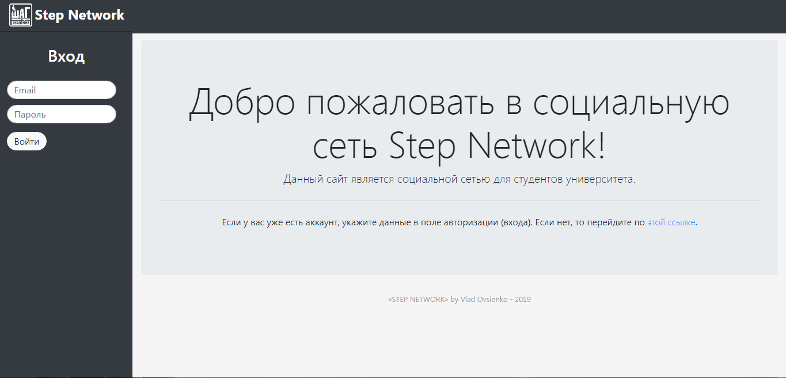
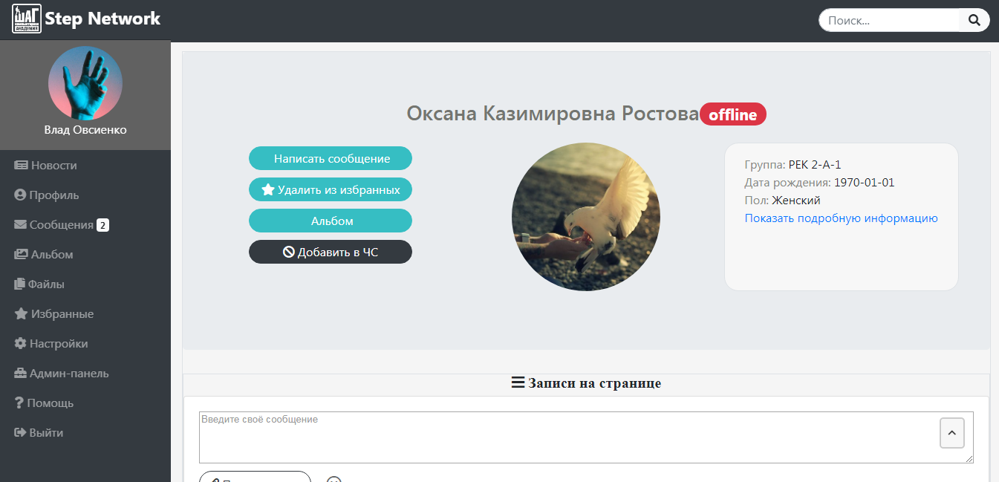
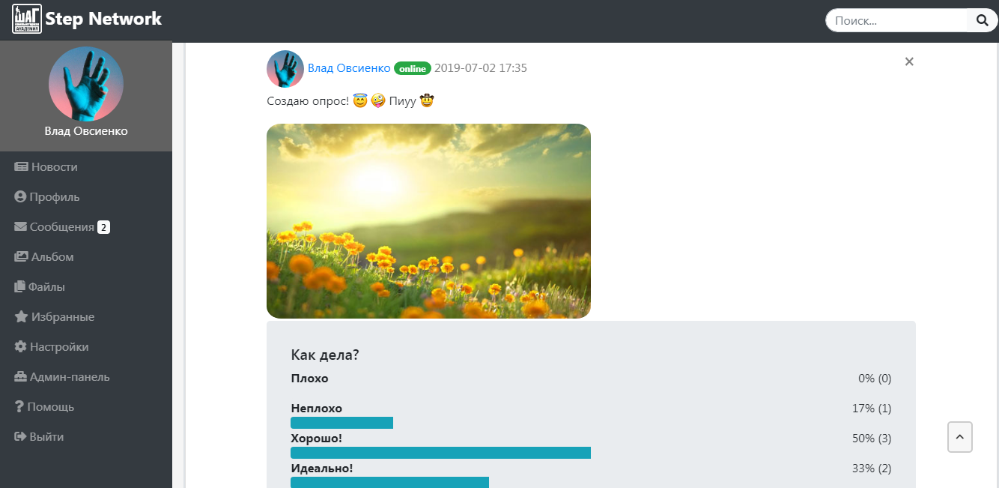
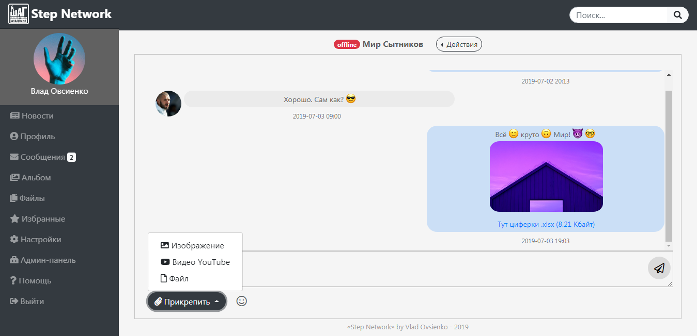
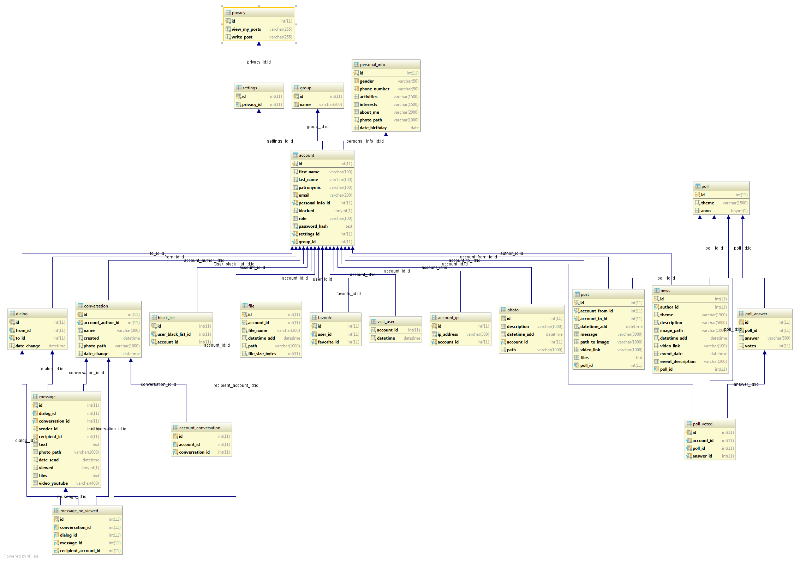

# STEP NETWORK – Student Social Network (Diploma Project)

**STEP NETWORK** is a full-stack social networking platform built as a university diploma project.  
It is designed specifically for students, offering functionality similar to modern social networks with academic context.

The project includes:
- **Backend API** (Yii2 + MySQL)
- **Client web interface** (Yii2 + Bootstrap)
- **Database schema**
- **Documentation & presentation**

---

## 🗂 Project Structure

├── DataBase/  
│ ├── Accounts.txt # Sample test accounts  
│ ├── student_social_network.sql # MySQL schema setup  
│ └── student_social_network.png # DB structure diagram  
│  
├── Screenshots/ # Screenshots from web interface  
│  
├── StudentSocialNetwork_API/ # Backend API (Yii2, PHP, MySQL)  
│  
├── StudentSocialNetwork_Client/ # Frontend client (Yii2, Bootstrap, jQuery)  
│  
├── Адреса хостингов.txt # (Outdated) test deployment addresses  
├── Пояснительная записка.docx # Full explanatory write-up (RU)  
├── Презентация.pptx # Project presentation with screenshots & diagrams  
└── README.md # You're reading it  

---

## 🌐 Technologies Used

- PHP ≥ 5.4 (Yii2 Framework)
- MySQL (InnoDB)
- Bootstrap 4, jQuery
- API architecture

---

## 🧪 Demo Screenshot

*Above: Login page*

*Above: Profile page*

*Above: Post page*

*Above: Chat page*

*ALL SCREENSHOTS IN FILE: Презентация.pptx*

*Above: Database structure for STEP NETWORK*

---

## ⚙️ How to Run the Project

1. Import the database from `DataBase/student_social_network.sql`
2. Set up the API (`StudentSocialNetwork_API/`) – [see API README](./StudentSocialNetwork_API/README.md)
3. Set up the client (`StudentSocialNetwork_Client/`) – [see Client README](./StudentSocialNetwork_Client/README.md)
4. Use credentials from `DataBase/Accounts.txt` to log in

---

## 📄 Documents

- 📘 *Пояснительная записка.docx* – full system explanation  
- 📊 *Презентация.pptx* – screenshots, flowcharts, and presentation slides  
- 🗺️ *Адреса хостингов.txt* – archive of previously used demo links

---

## 📌 Notes

- This is an educational project, not intended for production
- Some parts use legacy PHP features due to university constraints
- Contributions welcome for modernization

---

## 📄 License

MIT – use it, fork it, break it, learn from it
